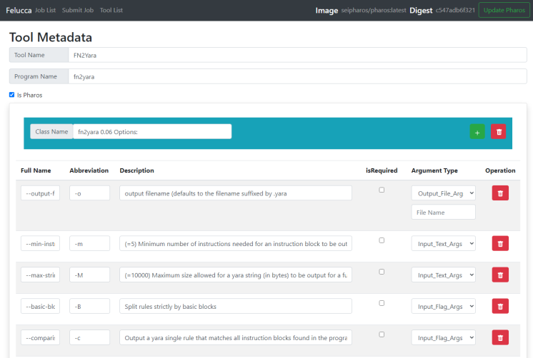
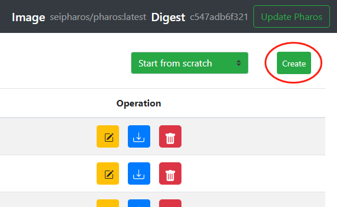
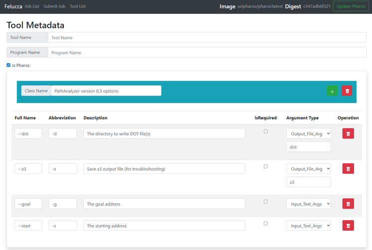

# Felucca

A system providing Pharos tools as a web service

[Automated static analysis tools for binary programs](https://github.com/cmu-sei/pharos.git)

# Felucca Installation
[Installation](https://github.com/MITS-Felucca/Felucca/blob/master/installation.md)

# Felucca Quickstart

## Concept
- `task` : A task is the minimum execution unit in Felucca. It means a single execution using a specific `tool` .
- `job` : A job is a collections of `task` . It may consist of a single task or multiple tasks.
- `tool` : A tool is command line tool that is installed in kernel. It may takes some arguments and input files, then generate output files and text output.
- `schema` : A schema is the metadata of a `tool` , it is made of `argument classes` .
- `argument Class` : An argument class is a collection of `argument` .
- `argument` : An argument consists of the basic information of `argument` . 
   - `Full Name` : The full name of this `argument` , e.g. `--output` 
   - `Abbreviation` : The abbreviation of this `argument` , e.g. `-o` 
   - `Description` : The text description of this `argument` .
   - `isRequired` : A boolean flag to tell if this `argument`  is required when using this tool.
   - `Argument Type` : The type of this argument:
      - `Output file` : If this argument is set, it would output a file to target filename. The default file name of the output file should be given in `Default Value` field, e.g. `--json output.json` 
      - `Input file` : If this argument is set, it means this tool would take a file as input. You need to upload this file.  `-f oo.exe` 
      - `Input flag` : If this argument is set, it means a flag argument, e.g. `--address-only` 
      - `Input Text` : If this argument is set, it means a flag argument followed by its input string, e.g. `--verbose 5` 
   - `Default Value` : When this argument's type is output file, it has a default filename which should be given in this field.

## Job Management
### Job Submission
#### 1. Submit a job with a single task

1. Click `Submit job` button in header.
2. Type the name and comment of your job, job name is required for each job.

    
     
    <em>Starting Job Submission</em>

3. Choose a tool in the tool list, after you choose a tool, its argument form would appear below.
4. Then, you need to specify the argument of this execution. The save would be disabled until you finish all the required arguments. Note that for different types of argument, its input meaning is different. 
   1. For output file type argument, the checkbox means if you want to see this output file after the execution. 
   2. For input file type argument, you need to upload a file.
   3. For input flag type argument, the checkbox means if you want to include this flag in this execution.
   4. For input text type argument, if you type something in the input text area, it would be given to the tool in this execution. 

    
     
    <em>Arguments of each task</em>

5. After you finish specifying the arguments, click `Save` . Then you could view and confirm your task argument in the list below.

    
     
    <em>Save the task arguments</em>

6. If everything is ok, click `Submit` . Then a popup would show and tells you if your submission is successful or not.
7. Back to the Dashboard, you could find your job in the job list.

    
     
    <em>Basic information of a job</em>

#### 2. submit a job with multiple tasks

1. You could also add more than one task inside a single job. All you need to do is to choose tool again after you save your first task.

    
     
    <em>Job with multiple tasks</em>

### Job Information
#### 1. Check the status of job and tasks

- The job status are shown in dashboard.
- The task status are shown inside job information page.
- Job Status are defined as below:
   - `Pending` : This job is waiting to be executed.
   - `Running` : This job is running. A job is running if one of its tasks is running.
   - `Finished` : This job is finished. A job is finished if all of its tasks if not pending or running.
- Task Status are defined as below:
   - `Pending` : This task is waiting to be executed.
   - `Running` : This task is running. 
   - `Successful` : A task is successful only if its execution return value is 0.
   - `Failed` : A task is failed if its execution return value is not 0.
   - `Error` : A task is error if some internal error happen inside Felucca, which means this task cannot be executed.
   - `Killed` : A task is killed if user manually kills this task or kills the job it belong.

    
     
    <em>Job information page</em>

#### 2. Check the standard output and error message in realtime.

- After a task starts to run, you could check its output in realtime instead of waiting for it to finish. It may help you have a better understanding on what's going on inside this execution.
- Just click `stdout` or `stderr` inside job information page of some task. Then, you could see the realtime output in the output display page. You could also download this output for further use.

    
     
    <em>Job information page before finished</em>

    
     
    <em>Realtime stdout output</em>

#### 3. Check the output file of task

- After a task is finished, you could check the output file in the job information page. Click the filename inside the "Arguments" column in that task, you could view the output file in text format.
- You could also download the file in text format using the download button.

### Kill job
#### 1. kill a task

- If you found a task behave unexpectedly, you could kill that task inside the job information page. Felucca would terminate the task and recycle all its resource, but its standard output and error message are reserved. Note that if a task is already finished (succeed or failed) by the time Felucca kills it, it will remain as its current status.

#### 2. kill a job and all tasks inside

- If you found a job behave unexpectedly, you also could kill that job. Killing a job is identical to killing all the tasks inside that job.

    
     
    <em>Task Killed</em>

## Tool Management
### Browse all available tools
By clicking on the `Tool List` button in the upper left corner, all available tools will be shown. Initially there are 10 tools from the current version of Pharos, which are manually added by us. 

    
   <em>The list of available tools</em>

### Edit the schema of existing tools
For each tool, we use `schema` to store its metadata, including `Tool Name`, `Program Name`, `Parameters` etc. To edit a schema, just click the yellow `Edit` button under `Operation` column. Then we can modify the schema of the tool in the page like the figure below.

    
   <em>The schema of a tool</em>

To make the schema more clear, **parameters **can be organized into **classes**. Each class contains a list of parameters. Besides, each parameter contains its `Full Name`, `Abbreviation`, `Description`, `IsRequired` flag and its `Argument Type`. For the `Full Name` and `Abbreviation`, the parameter should have at least one of them to make it valid. They will be used during the construction of the command.
There are **four types** of parameters: 

- **Input_File_Args**: This represents a file as input. We need to specify a file for parameters of this type.
- **Input_Flag_Args**: Parameters of this type contain nothing else but themselves. 
- **Input_Text_Args**: In CLI, this type of parameters are followed by its value. For example, parameter "--verbose" requires a number as its value, which stands for the logging level.
- **Output_File_Args**: Parameters of this type mean that they will produce some result as files. And they will have another input box for the name of the output file. (_The file name is required_)

The explanation of these four types will be shown in the hover as below.

    
   <em>The explanation of four types of parameters</em>

After all modification, click the `Save` button in the bottom to save your work.

    
   <em>Save after editing a schema</em>

### Creating a new schema for new tools
To create a new schema, just click the create the `Create` button in the upper right corner of the `Tool List` page. By default, it will **create a brand new one**("Start from scratch"). Then you can fill in the `Tool Name`, `Program Name`, `Parameters`.

    
   <em>Create a new schema</em>

    
   <em>The schema will be empty initially</em>

Other than that, you can click and **choose an existing tool as your starting point**. Under such a situation, it will automatically import all parameters of the chosen tool, leaving only the `Tool Name` and `Program Name` fields empty.

    
   <em>Choose an existing tool as the starting point</em>

    
   <em>Create a new tool from an existing tool</em>

### Export & Import Schemas
In case that the service needs to be migrated, we provide a convenient way to **export **and **import **the schemas. By clicking the blue "Download" button, the schema will be **downloaded as a json file**. 

    
   <em>Export a schema as json file</em>

To **import a schema** from the exported files, create a new tool first. Then click the upper right `Browse` button to choose an exported json file. Seconds after that, all metadata of the exported tool will be loaded. Don't forget to click "`Save`" in the bottom to finish the import.

    
   <em>Create a new schema first</em>

    
   <em>Import a schema from an exported file</em>

    
   <em>The schema imported from an exported file</em>

    
   <em>Save the imported schema</em>

### Remove tools
To remove a tool, just click the `Remove` button in the tool list. After that, the tool will still exist until you confirm the deletion in the dialog.

    
   <em>Remove a tool</em>

    
   <em>The dialog for confirmation before removing a tool</em>

## Updating Pharos Docker Image
Considering that _Pharos _keeps evolving, we provide a function to retrieve the latest _Pharos _docker image from _Docker Hub_. Normally, the registry and digest value of current docker image is shown in the top. You can click the `Update Pharos` button to update the docker image. 

    
   <em>The registry and digest of current version</em>

After that, a dialog will be shown and the registry of the new image is required. You can leave it empty, and it will use _seipharos/pharos:latest _as the default value. Remember that all running jobs will get killed once the update process begins.

    
   <em>The dialog for confirmation before updating Pharos</em>

During update process, submitting new jobs is not allowed. And the `Update Pharos` button is replaced by "Pharos Updating". When it finishes, the `Update Pharos` button will be back, and the digest value will be the one of the latest image.

   
    
   <em>Updating the latest image</em>

    
     
    <em>After the updating finished</em>

